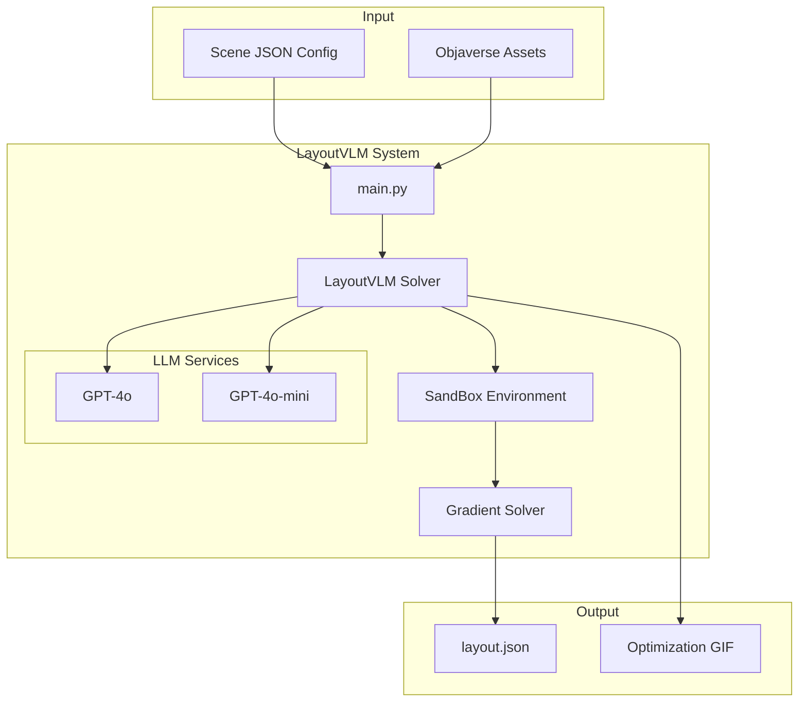
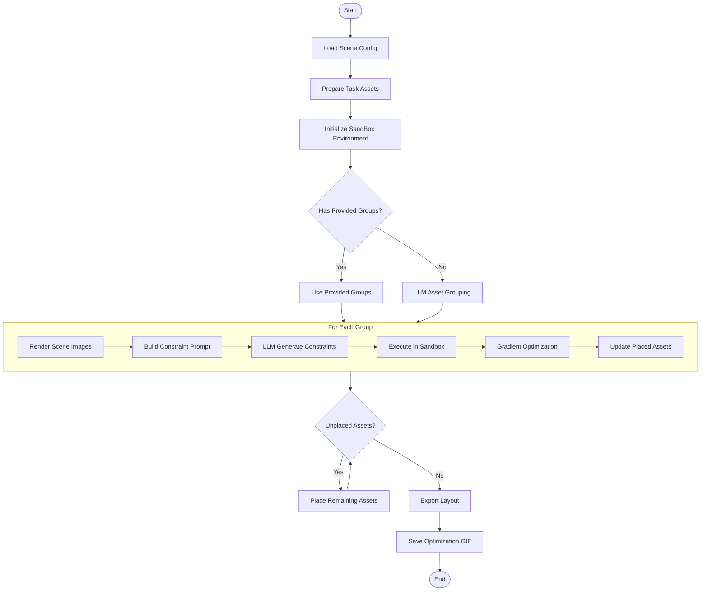
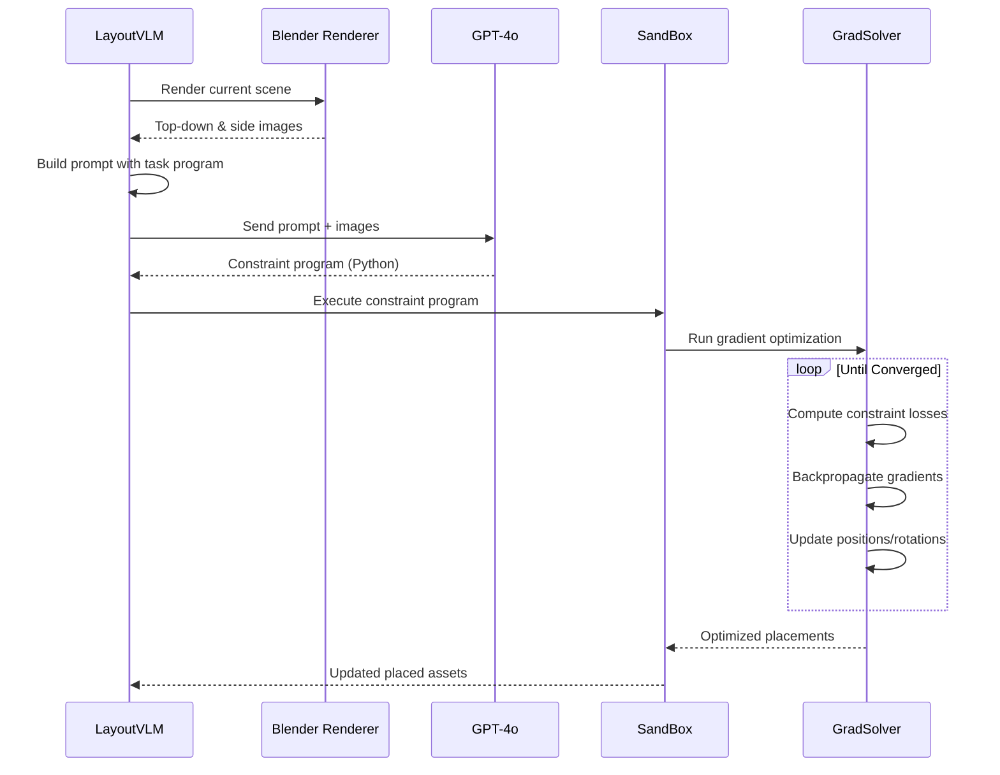

# LayoutVLM

<div align="left">
    <a href="https://ai.stanford.edu/~sunfanyun/layoutvlm"></a>
    <a href=""></a>
</div>

<br>

## Architecture Overview



## Solve Flow



## Single Group Solve Flow



## Installation

1. Clone this repository
2. Install dependencies (python 3.10):
```bash
pip install -r requirements.txt
```
3. Install Rotated IOU Loss (https://github.com/lilanxiao/Rotated\_IoU)
```
cd third_party/Rotated_IoU/cuda_op
python setup.py install
````

## Data preprocessing
1. Download the dataset https://drive.google.com/file/d/1WGbj8gWn-f-BRwqPKfoY06budBzgM0pu/view?usp=sharing
2. Unzip it.

Refer to https://github.com/allenai/Holodeck and https://github.com/allenai/objathor for how we preprocess Objaverse assets.

## Usage

1. Prepare a scene configuration JSON file of Objaverse assets with the following structure:
```json
{
    "task_description": ...,
    "layout_criteria": ...,
    "boundary": {
        "floor_vertices": [[x1, y1, z1], [x2, y2, z2], ...],
        "wall_height": height
    },
    "assets": {
        "asset_id": {
            "path": "path/to/asset.glb",
            "assetMetadata": {
                "boundingBox": {
                    "x": width,
                    "y": depth,
                    "z": height
                }
            }
        }
    }
}
```

2. Run LayoutVLM:
```bash
python main.py --scene_json_file path/to/scene.json --openai_api_key your_api_key
```

## Output
The script will generate a layout.json file in the specified save directory containing the optimized positions and orientations of all assets in the scene.

## BibTeX
```bibtex
@inproceedings{sun2025layoutvlm,
  title={Layoutvlm: Differentiable optimization of 3d layout via vision-language models},
  author={Sun, Fan-Yun and Liu, Weiyu and Gu, Siyi and Lim, Dylan and Bhat, Goutam and Tombari, Federico and Li, Manling and Haber, Nick and Wu, Jiajun},
  booktitle={Proceedings of the Computer Vision and Pattern Recognition Conference},
  pages={29469--29478},
  year={2025}
}
```
