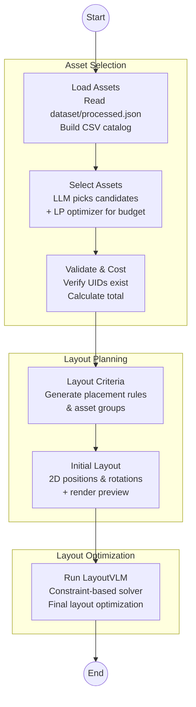

# Pipeline

LangGraph-based pipeline for furniture selection and layout generation using Gemini 2.5 Flash with thinking.

## Flow



## Architecture

### Asset Selection (Two-Step Process)
1. **LLM Candidate Selection**: Gemini 2.5 Flash identifies needed categories and selects 2-3 candidate assets per category with preference scores (style, material coherence, room fit)
2. **LP Optimization**: Mixed-Integer Linear Programming (scipy.optimize.milp) maximizes preference scores while respecting budget and category constraints

### Layout Generation
- **Layout Criteria**: LLM generates task description, placement rules, and asset groupings
- **Initial Layout**: LLM places assets in 2D with positions/rotations, renders preview PNG
- **LayoutVLM Solver**: External constraint-based solver optimizes final layout

## Project Structure

```
pipeline/
├── main.py                 # Entry point, LangGraph pipeline
├── core/
│   ├── llm.py              # Gemini client & configs
│   ├── asset_manager.py    # Output file management
│   └── pipeline_shared.py  # Stage directories, logging
├── nodes/
│   ├── load_assets.py      # Load dataset to CSV
│   ├── select_assets.py    # LLM + LP asset selection
│   ├── validate_and_cost.py
│   ├── layout_criteria.py  # Generate rules & groups
│   ├── initial_layout.py   # 2D layout + preview
│   └── run_layoutvlm.py    # LayoutVLM solver
├── integrations/
│   └── layoutvlm_integration.py
└── rendering/
    └── layout_preview.py   # Matplotlib 2D visualization
```

## Stages Output

Each run creates timestamped folder in `outputs/` with:

| Stage | Output |
|-------|--------|
| `00_meta` | run_meta.json, final_state.json |
| `01_load_assets` | assets.csv, assets_data.json |
| `02_select_assets` | prompt.txt, candidates.json, lp_optimization.json, response.json |
| `03_validate_and_cost` | selected_assets.json |
| `04_layout_criteria` | prompt.txt, response.json, payload.json, reasoning_trace.txt |
| `05_initial_layout` | prompt.txt, response.json, layout.json |
| `06_draw_layout_preview` | layout_preview.png |
| `07_layoutvlm` | layoutvlm_task.json, solver/, layoutvlm_layout.json |

## Usage

```bash
cd pipeline
python main.py              # Run with defaults
python main.py --interactive  # Prompt for inputs
```

Default inputs:
- Design intent: "Modern minimalist living room"
- Budget: $1500
- Room: 5m x 6m
